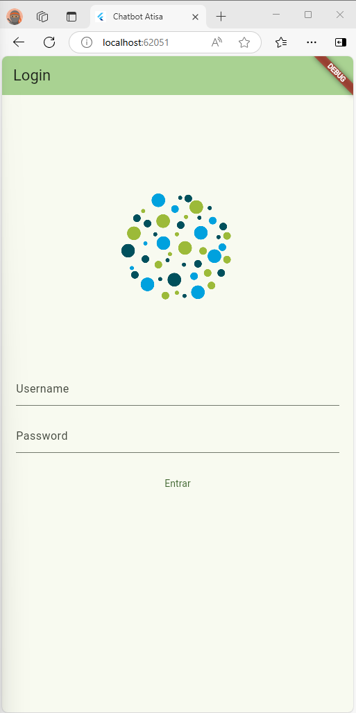
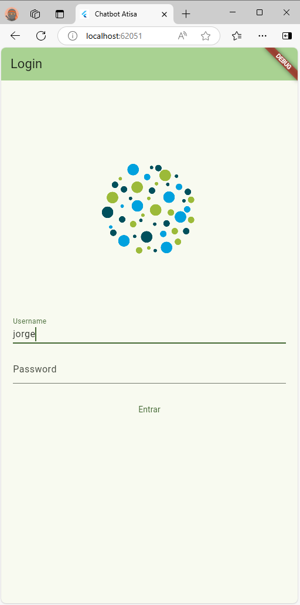
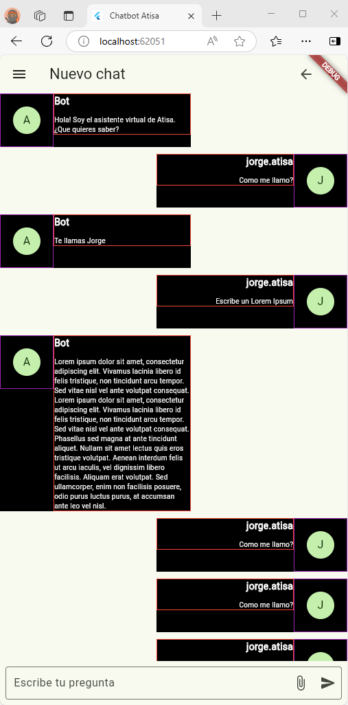
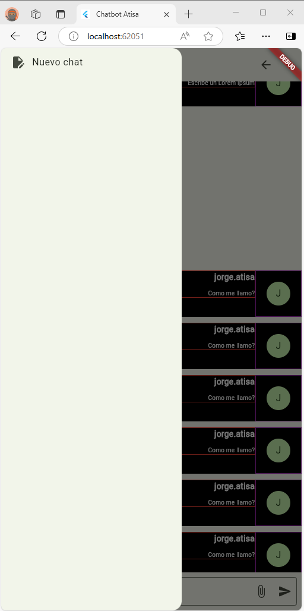
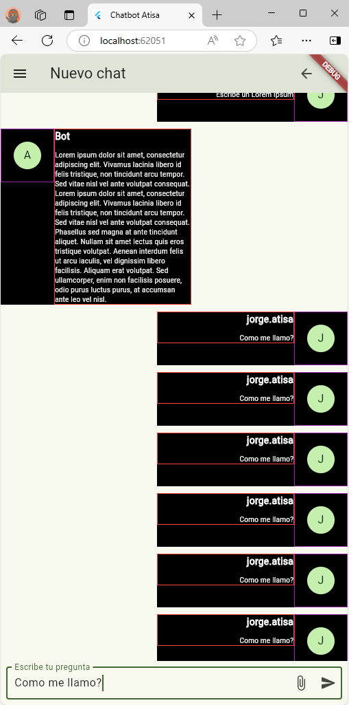

# frontend_flutter

## Subproyecto del chatbot de Atisa.

**Misión**: Desarrollar app en Flutter que reciba y mande datos a la API. 
Funciona como un chat.

Para ejecutar este proyecto, ubícate en la carpeta ```frontend_flutter``` en linea de comandos y ejecuta ```flutter run```.
Hace falta tener el SDK de Flutter descargado e integrado en el SO, y en variables del entorno del sistema (path variables).


## Login screen:

Introduce usuario y contraseña para acceder al chat.
|    |    |
| -- | -- |
| |  |


## Chat screen & menu:
 - Manda preguntas al chatbot y recibe respuestas (está en estado de maquetación).
 - Elige acceder a chats almacenados mediante menú. Crea chats, bórralos, o cámbiales el nombre.

|    |    |
| -- | -- |
| |  |


Vuelve a atrás pinchando en el logo 'go back'.
|    |    |
| -- | -- |
| |  |


## Tareas:

- [x] Hacer Screen de [Login](./lib/main.dart).
- [ ] Recibir o falsear parámetros para pasar a la siguiente Screen.
- [x] Hacer Screen de [Chat](./lib/screens/chat.dart).
- [x] [Falsear datos recibidos](./lib/data/data.dart) (emisor, id, contenido mensaje, etc).
- [x] Separar en **Widgets** los componentes, organizados.
- [x] Botón de vuelta atrás funcional (Chat => Login).
- [x] Botón de menú falseado, recopilando chats diferentes.
- [ ] Recibir datos de la API, por internet / conexión local.
- [ ] Roles de usuario.


<details>

<summary>Getting Started with Flutter</summary>

A new Flutter project.


This project is a starting point for a Flutter application.

A few resources to get you started if this is your first Flutter project:

- [Lab: Write your first Flutter app](https://docs.flutter.dev/get-started/codelab)
- [Cookbook: Useful Flutter samples](https://docs.flutter.dev/cookbook)

For help getting started with Flutter development, view the
[online documentation](https://docs.flutter.dev/), which offers tutorials,
samples, guidance on mobile development, and a full API reference.

</details>